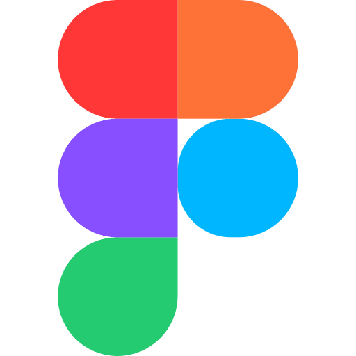
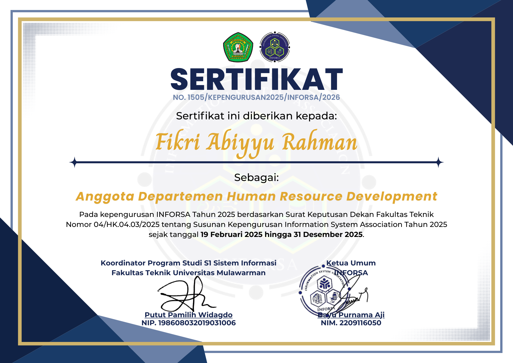

# 🎨 KEP — Personal Portfolio Website

> *"Creating Visual Stories That Speak."*

Sebuah website portofolio pribadi milik **Fikri Abiyyu Rahman** — seorang mahasiswa yang berfokus di bidang desain, fotografi, dan editing. Website ini dibangun menggunakan HTML, CSS, dan Bootstrap 5 sebagai tugas Mini Project mata kuliah Pemrograman Berbasis Web (PBW).

---

## 📋 Deskripsi Singkat

**KEP Portfolio** adalah website portofolio statis berbasis HTML/CSS yang menampilkan profil pribadi, keahlian (hard skill & soft skill), riwayat pendidikan dan pengalaman kerja, serta koleksi sertifikat yang dimiliki. Desain menggunakan tema gelap (*dark mode*) dengan tipografi Poppins untuk kesan modern dan profesional.

---

## ✨ Fitur Utama

- **Navigasi Responsif** — Navbar sticky dengan efek collapse di perangkat mobile
- **Hero Section** — Tampilan pembuka yang bold dan impactful
- **About Me** — Foto diri, deskripsi, hard skill dengan progress bar animasi, dan soft skill
- **Progress Bar Animasi** — Visualisasi tingkat keahlian per software dengan warna unik
- **Certificates Gallery** — Grid kartu sertifikat yang responsif
- **Fully Responsive** — Tampilan optimal di desktop, tablet, dan smartphone
- **Dark Theme** — Desain konsisten bernuansa gelap dan elegan

---

## 🖼️ Tampilan Setiap Section

### 1. Navbar
Navigasi tetap di bagian atas halaman dengan latar belakang hitam dan teks putih. Terdapat tombol *hamburger* untuk tampilan mobile.

```
[ KEP ]   Home   About Me   Certificates
```

> 📸 *Screenshot placeholder — Navbar Desktop & Mobile*


---

### 2. Hero Section
Bagian pembuka dengan heading besar bertuliskan *"Creating Visual Stories That Speak."* dan subjudul yang menjelaskan identitas singkat pemilik portofolio.

> 📸 *Screenshot placeholder — Hero Section*


---

### 3. About Me Section
Terbagi menjadi beberapa sub-bagian:

- **Foto diri** dengan efek crop dan border elegan
- **Deskripsi pribadi** yang menjelaskan latar belakang dan passion
- **Hard Skill** — 6 kartu software (Illustrator, Photoshop, Premiere Pro, Affinity Studio, DaVinci Resolve, Figma) masing-masing dengan progress bar berwarna
- **Soft Skill** — Riwayat pendidikan, pengalaman kerja, dan pengalaman organisasi

> 📸 *Screenshot placeholder — About Me Section*


> 📸 *Screenshot placeholder — Hard Skill Cards & Soft Skill Panel*


---

### 4. Certificates Section
Galeri sertifikat dalam format grid (3 kolom di desktop, 2 di tablet, 1 di mobile) menggunakan Bootstrap Cards dengan gambar sertifikat, judul, dan penerbit sertifikat.

> 📸 *Screenshot placeholder — Certificates Section*


---

### 5. Footer
Footer sederhana berisi alamat email kontak (`kepvisual@gmail.com`) dengan garis pemisah di bagian atas.

---

## 🧩 Penjelasan Kode Setiap Section

### 📁 Struktur Folder

```
MINPRO-PBW-1/
│
├── index.html                  # File utama HTML
├── style.css                   # File styling utama
│
├── photos/
│   └── DSCF3219.JPG            # Foto profil
│
└── assets/
    ├── icon/                   # Ikon software (PNG)
    │   ├── adobe-illustrator-icon.png
    │   ├── adobe-photoshop-icon.png
    │   ├── adobe-premiere-pro-icon.png
    │   ├── affinity-studio-icon.png
    │   ├── DaVinci_Resolve_Studio.png
    │   └── figma-icon.png
    │
    └── certificates/           # Gambar sertifikat
        ├── INFORSA.png
        ├── APLIKASI.jpg
        ├── Job Fair.png
        ├── KC 1.jpg
        ├── KC 2.jpg
        └── SC.png
```

---

### 📄 HTML — Navbar

Menggunakan komponen Navbar Bootstrap 5 dengan `sticky-top` agar tetap terlihat saat scroll.

```html
<nav class="navbar navbar-expand-lg sticky-top" style="background-color: rgb(0, 0, 0);" data-bs-theme="dark">
  <div class="container-fluid">
    <a class="navbar-brand poppins-bold" href="#">KEP</a>
    <button class="navbar-toggler" type="button" data-bs-toggle="collapse" data-bs-target="#navbarNavAltMarkup">
      <span class="navbar-toggler-icon"></span>
    </button>
    <div class="collapse navbar-collapse" id="navbarNavAltMarkup">
      <div class="navbar-nav poppins-medium">
        <a class="nav-link" href="#Home">Home</a>
        <a class="nav-link" href="#Aboutme">About Me</a>
        <a class="nav-link" href="#certificates">Certificates</a>
      </div>
    </div>
  </div>
</nav>
```

---

### 📄 HTML — Hero Section

Menggunakan `section` dengan ID `Home` dan class `hero` yang dikonfigurasi di CSS untuk tampil setinggi 80% viewport.

```html
<section id="Home" class="hero">
  <div class="container-fluid px-5">
    <h1 class="poppins-semibold">Creating Visual <br> Stories That Speak.</h1>
    <p class="poppins-medium" style="opacity: 0.2; padding-top: 24px;">
      I am a visual storyteller who turns complex problems into simple, <br>
      beautiful and easy to understand stories.
    </p>
  </div>
</section>
```

---

### 📄 HTML — Hard Skill (Progress Bar)

Setiap kartu hard skill memuat ikon, nama software, dan Bootstrap Progress Bar dengan warna kustom dari CSS variable.

```html
<div class="hard-skill">
  
  <p class="poppins-medium">Figma</p>
  <div class="progress" role="progressbar" aria-valuenow="85" aria-valuemin="0" aria-valuemax="100">
    <div class="progress-bar progress-bar-striped progress-bar-animated"
         style="width: 85%; background-color: var(--color-orange-figma);">
      85%
    </div>
  </div>
</div>
```

---

### 📄 HTML — Certificate Cards

Sertifikat ditampilkan menggunakan komponen Card Bootstrap dalam sistem grid responsif.

```html
<div class="col-12 col-md-6 col-lg-4">
  <div class="card h-100">
    
    <div class="card-body">
      <h5 class="card-title aliceblue poppins-semibold">Certificate of Organizational Management - INFORSA</h5>
      <p class="card-text poppins-medium" style="opacity: 0.4;">Information Systems Student Association (INFORSA)</p>
    </div>
  </div>
</div>
```

---

### 🎨 CSS — Variabel Warna & Tema

Warna progress bar masing-masing software didefinisikan sebagai CSS custom property (variabel) agar mudah dikelola.

```css
:root {
  --color-orange: #FF9A00;        /* Adobe Illustrator */
  --color-blue: #2585ca;          /* Adobe Photoshop */
  --color-purple: #00005B;        /* Adobe Premiere Pro */
  --color-green: #5ea132;         /* Affinity Studio */
  --color-red: #ED3B43;           /* DaVinci Resolve */
  --color-orange-figma: #FF7237;  /* Figma */
}
```

---

### 🎨 CSS — Hero Section

```css
.hero {
  display: flex;
  justify-content: left;
  align-items: center;
  min-height: 80vh;
  text-align: left;
}
```

---

### 🎨 CSS — Gambar Profil

Foto profil dibungkus dalam `.gambar-wrapper` dengan `aspect-ratio` dan `overflow: hidden` untuk efek crop rapi.

```css
.gambar-wrapper {
  display: block;
  width: 100%;
  height: 100%;
  aspect-ratio: 3 / 3;
  overflow: hidden;
  border-radius: 3%;
  border: 2px solid #ffffff1e;
}

.gambar {
  width: 100%;
  height: 100%;
  object-fit: cover;
  transform: scale(1.5) translate(8%, 8%);
}
```

---

### 🎨 CSS — Kartu Hard Skill & Soft Skill

```css
.hard-skill {
  display: flex;
  flex-direction: column;
  align-items: left;
  gap: 4px;
  background-color: rgb(10, 10, 10);
  height: 100%;
  width: 100%;
  padding: 24px;
  border: 2px solid #ffffff1e;
  border-radius: 12px;
}
```

---

### 🎨 CSS — Tipografi (Poppins)

Semua varian font Poppins didefinisikan sebagai utility class, memudahkan penerapan konsisten di seluruh elemen.

```css
.poppins-semibold {
  font-family: "Poppins", sans-serif;
  font-weight: 600;
  font-style: normal;
}
```

> ℹ️ *Project ini tidak menggunakan JavaScript/Vue JS secara terpisah. Interaktivitas (navbar collapse, progress bar animasi) sepenuhnya ditangani oleh Bootstrap 5 JS bundle.*

---

## 🛠️ Teknologi yang Digunakan

| Teknologi | Versi | Keterangan |
|---|---|---|
| HTML5 | — | Struktur dan konten halaman |
| CSS3 | — | Styling kustom dan layout |
| Bootstrap | 5.3.8 | Framework CSS responsif |
| Google Fonts | — | Tipografi Poppins |

---

## 🚀 Cara Menjalankan Project

Project ini merupakan website statis yang tidak memerlukan instalasi atau server khusus.

**Cara 1 — Buka Langsung:**
1. Clone atau unduh repository ini
2. Buka file `index.html` langsung di browser

**Cara 2 — Menggunakan VS Code Live Server:**
1. Install ekstensi **Live Server** di VS Code
2. Klik kanan pada `index.html` → *Open with Live Server*
3. Website akan terbuka otomatis di `http://127.0.0.1:5500`

> ⚠️ Pastikan seluruh folder (`assets/`, `photos/`) berada dalam satu direktori yang sama dengan `index.html` agar gambar dan ikon tampil dengan benar.

---

## 📁 Struktur Folder

```
MINPRO-PBW-1/
│
├── index.html
├── style.css
├── README.md
│
├── photos/
│   └── DSCF3219.JPG
│
└── assets/
    ├── icon/
    │   ├── adobe-illustrator-icon.png
    │   ├── adobe-photoshop-icon.png
    │   ├── adobe-premiere-pro-icon.png
    │   ├── affinity-studio-icon.png
    │   ├── DaVinci_Resolve_Studio.png
    │   └── figma-icon.png
    │
    └── certificates/
        ├── INFORSA.png
        ├── APLIKASI.jpg
        ├── Job Fair.png
        ├── KC 1.jpg
        ├── KC 2.jpg
        └── SC.png
```